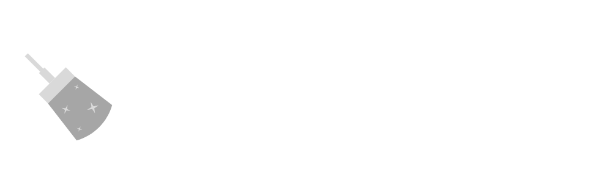

  

  <h3 align="center">Cleantoclean.com.au</h3>

  

    Cleaning Company Website
     
  

  <a  href="https://cleantoclean.com.au" target="_blank" >View Demo</a>

 
 

                                                                           
  

       

  
  
    
  
  
  
 	
  
 

  

